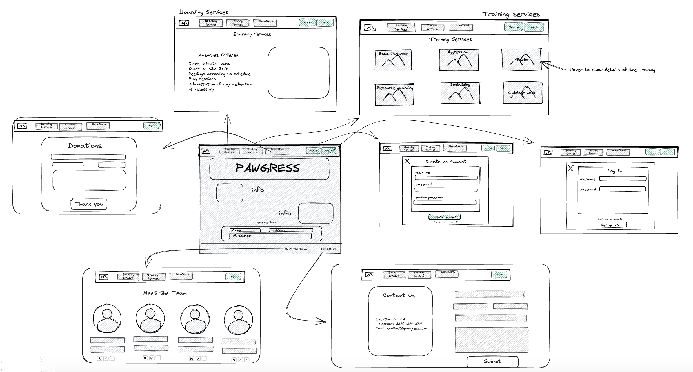
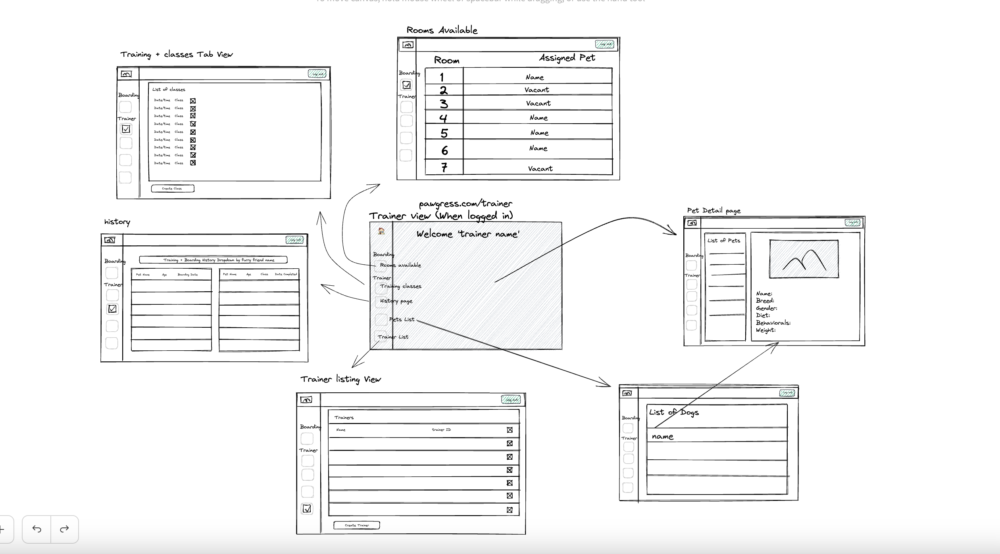
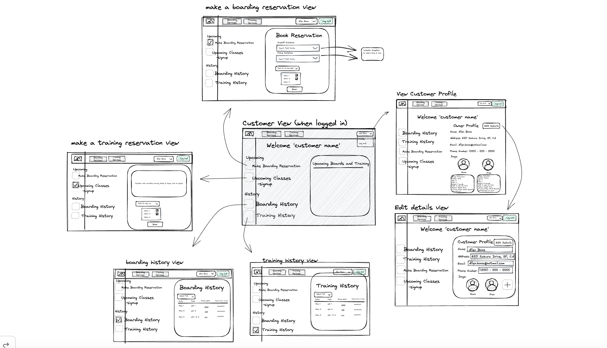

# Pawgress
- Jennifer Ho
- Jesse Preble
- Stephen Zhu
- Dahna Ahn

## Intended Market
---
We are targeting business owners in the pet industry seeking an encapsulating platform for optimal organization.

## Functionality
---
- Upon initial visit, our visitors will view our main page which includes:
  - Basic information about the services provided at the facility
  - A contact form for inquiries/comments
  - A donation page
  - A signup page to make a new account and sign in
- If given trainer authorization the user will be directed to the users platform which includes:
  - The ability to create a new class for customers
  - A list of all upcoming classes
  - A list of all trainers information
  - The ability to create a new room for boarding
  - A list of all the existing rooms and their occupancy status
  - A list of all the pets currently at the facility
  - The ability to manually add a pet to the list of pets
  - A list of the full history of both training and boarding
- If given customer authorization the user will be redirected to the customer platform which includes:
  - Show the user's personal information and the ability to update information as needed
  - The ability to edit their pet's information
  - The ability to submit a form requesting a boarding service
  - The ability to sign up for a training class
  - A list of the complete history of the training and boarding of their pet

## Project Initialization
---
To begin this application on your local machine, please follow these steps:
1. Clone the repository to your local machine
2. CD into the new project directory
3. Run `docker volume create pawgress-db`
4. Run `docker compose build`
4. Run `docker compose up`


## Data Model
---
The application is composed of several models. The models are outlined in the /api/migrations/001_create_tables.py file and in pydantic models in the /api/queries/ folder.


<details>
  <summary>Users</summary>

  | Name         | Type                  | Unique | Optional |
  | ------------ | --------------------- | ------ | -------- |
  | first_name   | str                   | no     | no       |
  | last_name    | str                   | no     | no       |
  | address      | str                   | no     | no       |
  | email        | str                   | no     | no       |
  | phone_number | str                   | no     | no       |
  | role         | str default('customer')| no     | no       |
  | password     | str                   | no     | no       |

  The user model is the basis of the application and consists of an id, first_name, last_name, address, email, phone_number, role (customer or trainer), and a hashed_password. Depending on whether the user’s role is customer or trainer, different views and functionality will be available to the user.

</details>


<details>
  <summary>Pets</summary>

| Name        | Type        	| Unique     | Optional   |
| ----------- | ----------- 	|----------- |----------- |
| name        | str         	| no 		| no 		|
| breed       | str         	| no 		| no 		|
| gender      | str         	| no 		| no 		|
| age         | int         	| no 		| no 		|
| picture 	  | str         	| no 		| yes 		|
| size        | str         	| no 		| no 		|
| weight      | int         	| no 		| no 		|
| diet        | str	   	| no		| no		|
|owner_id     | reference to user entity | yes | no |

The pets model consists of a pet_id, name, breed, gender, age, an optional picture, size, weight, diet, a foreign key owner_id which references a user’s id. Pets will be created by users as part of the user’s profile and used for signing up for training and boarding services. Trainers can view pets that are boarded and see pet details to aid them in their job.

</details>

<details>
  <summary> Rooms</summary>

| Name        | Type        	        | Unique     | Optional   |
| ----------- | ----------------------|----------- |----------- |
| room_number | str         	        | no 		     | no 		|
| occupied    | boolean default(False)| no 		      | no 	|
| pet_id      | reference to pet entity| no 		    | no 		|

The rooms model consists of a room_id, room_number, occupied, and a foreign key pet_id which references pets. This model is utilized by trainers to keep track of what rooms are occupied and which pets are in which rooms.

</details>

<details>
  <summary>Classes</summary>

| Name        | Type        	| Unique     | Optional   |
| ----------- | ----------- 	|----------- |----------- |
| name        | str         	| no 		| no 		|
| category       | str         	| no 		| no 		|
| attendees      | str         	| no 		| no 		|
| max_attendees         | int         	| no 		| no 		|
| start_datetime 	  | str         	| no 		| yes 		|
| end_datetime        | str         	| no 		| no 		|
| description      | int         	| no 		| no 		|

The classes model consists of a class_id, name, category, attendees, max_attendees, start_datetime, end_datetime, and description. This model is used for creating training classes that users can later sign their pets up for.

</details>

<details>
  <summary> Reservations</summary>

| Name        | Type        	| Unique     | Optional   |
| ----------- | ----------- 	|----------- |----------- |
| start_datetime | datetime      | no 		| no 		|
| end_datetime  | datetime       | no 		| no 		|
| category      | str         	| no 		| no 		|
| customer_id   | reference to customer entity         	| no 		| no 	|

The reservations model consists of a reservation_id, start_datetime, end_datetime, category, and a foreign key customer_id which references users. This model is used for boarding or training reservations that a user can sign up for and also view the history of.

</details>

<details>
  <summary> Pet Reservations </summary>

| Name        | Type        	| Unique     | Optional   |
| ----------- | ----------- 	|----------- |----------- |
| reservation_id | reference to reservation id      | yes 		| no 	|
| pet_id  | reference to pet id        | yes 		| no 		|

The pet_reservations table is a part of the reservations model and is used to link pet_id and reservation_id. It consists of two foreign keys, reservation_id referencing reservations and pet_id referencing pets.

</details>


## APIs
---
The APIs for the application are in the /api/routers folder. The folder contains all the API endpoints for the various models.

<details>
  <summary>Users</summary>

- **Method**: `POST`, `GET`, `GET`, `PUT`, `DELETE`,
- **Path**: `/api/accounts`, `/api/accounts/<int:user_id>`, `/api/accounts/<int:user_id>/password`

Input:
```
{
  "first_name": "string",
  "last_name": "string",
  "address": "string",
  "email": "string",
  "phone_number": "string",
  "role": "string",
  "password": "string"
}
```

Output:
```
[
  {
    "id": int,
    "first_name": "string",
    "last_name": "string",
    "address": "string",
    "email": "string",
    "phone_number": "string",
    "role": "string"
  }
]
```
The accounts.py file contains APIs for user authentication and tokens, creating an account, getting a list of all users, getting a specific user’s data, updating a user’s data, updating a user’s password, and deleting a user.
</details>

<details>
  <summary>Pets</summary>

- **Method**: `POST`, `GET`, `GET`, `PUT`, `DELETE`,
- **Path**: `/api/pets`, `/api/pets/<int:pet_id>`

Input:
```
{
  "name": string,
  "breed": string,
  "gender": string,
  "age": int,
  "picture": string,
  "size": string,
  "weight": int,
  "diet": string,
  "owner_id": int
}
```

Output:
```
[
  {
  "pet_id": int,
  "name": string,
  "breed": string,
  "gender": string,
  "age": int,
  "picture": string,
  "size": string,
  "weight": int,
  "diet": string,
  "owner_id": int
  }
]
```
The pets.py file contains APIs for creating a pet, getting a list of all pets, getting a specific pets data, deleting a pet, and updating a pet.
</details>

<details>
  <summary>Classes</summary>

- **Method**: `POST`, `GET`, `GET`, `PUT`, `DELETE`,
- **Path**: `/api/classes`, `/api/classes/<int:class_id>`

Input:
```
{
  "name": string,
  "category": string,
  "max_attendees": int,
  "start_datetime": datetime,
  "end_datetime": datetime,
  "description": string
}
```

Output:
```
[
  {
    "class_id": int,
    "name": string,
    "category": string,
    "attendees": int,
    "max_attendees": int,
    "start_datetime": datetime,
    "end_datetime": datetime,
    "description": string
  }
]
```
The classes.py file contains APIs for creating a class, getting a list of all classes, getting a specific class's data, updating a class, and deleting a class.
</details>

<details>
  <summary>Rooms</summary>

- **Method**: `POST`, `GET`, `PUT`, `DELETE`,
- **Path**: `/api/rooms`, `/api/rooms/<int:room_id>`

Input:
```
{
  "room_number": string,
  "occupied": boolean,
  "pet_id": int
}
```

Output:
```
[
  {
    "room_id": int,
    "room_number": string,
    "occupied": boolean,
    "pet_id": int
  }
]
```
The rooms.py file contains APIs for creating a room, getting a list of all rooms, updating a room, and deleting a room.
</details>

<details>
  <summary>Reservations</summary>

- **Method**: `POST`, `GET`
- **Path**: `/reservation`

Input:
```
{
  "start_datetime": datetime,
  "end_datetime": datetime,
  "category": string,
  "customer_id": int,
  "pet_id": int
}
```

Output:
```
[
  {
    "reservation_id": int,
    "start_datetime": datetime,
    "end_datetime": datetime,
    "category": string,
    "customer_id": int,
    "pet_id": int
  }
]
```
The reservations.py file contains APIs for creating a reservation and for getting a list of all reservations.
</details>

## GHI
---

## Main page
This will be the first page our users will see. It contains our main page with links in the navigation bar to redirect to informative pages on training and boarding services provided by the facility and a donation page. At the bottom of the page we have a functioning contact form for users to leave questions or suggestions. In our footer we also included a link to a page to learn more about the team of developers and another contact form.



## Trainer View
After logging in with the correct credentials as a trainer, the user will view the trainer's main page with a side bar navigation to different links. User will be able to view a full list of the dogs currently at the boarding facility as well as a detailed card of the dogs information. The user can also manually add a new dog to the facility. Users can see a list of the upcoming training classes and create one. There is also a history page of all the past boarding and training classes and the dogs associated. Users can also view the room occupancy of the facility and add new rooms.




## Customer View
After logging in with customer credentials, the user will view the customer's main page which is similarly modeled to the trainer's view. Users can sign their dog up for boarding or training classes as well as view the history of their pet's stays or classes they have attended. Customers also can view their personal information and their dog's information with the option to make any changes as they see fit.


